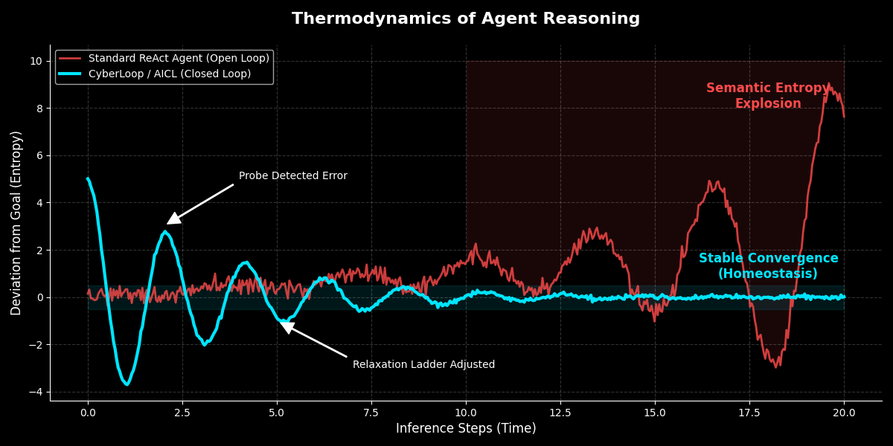

# 🧠 CyberLoop

[](./LICENSE)
[](https://doi.org/10.5281/zenodo.17913395)
[](https://github.com/roackb2/cyberloop/actions/workflows/pr-checks.yml)

<p align="center">

</p>

<p align="center">
<strong>"Stop building open-loop agents. They drift. They fail. They burn money."</strong>

<em>Figure 1: Conceptual model of stability. Standard agents (Red) accumulate entropy over time.

CyberLoop (Blue) dampens this oscillation through closed-loop feedback.</em>
</p>

---

## v2.1: The Rise of Physiological AI

> **"Your agent doesn't need a bigger brain. It needs a better body."**

**CyberLoop** is the reference implementation of **AICL (Artificial Intelligence Control Loop)**. It treats Agentic Reasoning not as a prompt engineering problem, but as a **Control Theory** problem.

In **v2.1**, we introduce **Semantic Kinematics**: giving agents a "vestibular system" (inner ear) to detect drift in vector space without needing to "think" (query an LLM). This allows agents to navigate complex knowledge graphs using **pure mathematics**—making them 100x faster and cheaper than traditional Chain-of-Thought agents.

---

## 🚀 Hero Demo: Project Ariadne

**Can an agent find the link between "Coffee" and the "French Revolution" without an LLM?**

Using CyberLoop v2.1, the agent navigates Wikipedia using only **Embeddings + PID Control**. It "senses" semantic proximity and "reflexively" corrects course when it drifts or gets bored.

### ⚡️ Run it yourself

```bash
# 1. Install dependencies
yarn install

# 2. Run the Deep-Dive Scenario (Coffee -> French Revolution)
yarn examples:wikipedia revolution

```

### 📊 Benchmark Results

| Metric | Pure LLM Agent (Typical) | CyberLoop v2.1 (Actual) | Impact |
| --- | --- | --- | --- |
| **Decision Mechanism** | Reasoning (LLM) | **Sensing** (Vector + PID) | **Physiological** |
| **Latency per Step** | ~3,000ms | **~50ms** | **60x Faster** |
| **Cost per Step** | ~$0.01 | **~$0.0001** | **99% Cheaper** |
| **Behavior** | Stochastic | **Controlled** | Reproducible |

> 🔗 **See full benchmark:** [docs/benchmarks/wikipedia/benchmark-wikipedia-navigation.md](https://www.google.com/search?q=docs/benchmarks/wikipedia/benchmark-wikipedia-navigation.md)

---

## 🧬 Core Architecture: Mind & Body

CyberLoop separates the "Thinking" (Outer Loop) from the "Moving" (Inner Loop).

### 1. Inner Loop (The Body & Cerebellum)

The reflexive system that handles fast, deterministic navigation and exploration. **Zero LLM calls.**

* **🛡️ Probe (Sensor):**
Low-cost feasibility checks. It asks simple questions like *"Is the result set empty?"* or *"Did the API return 404?"* to generate immediate feedback signals.
* **🪜 Ladder (Actuator):**
Mechanisms to regulate exploration entropy. If a probe fails, the ladder adjusts parameters (e.g., relaxing search filters, expanding candidate pools) to overcome friction.
* **🧭 Kinematics Engine (v2.1):**
Uses **EKF/PID controllers** to detect "Semantic Drift". If the agent's path diverges too far from the goal vector, the engine applies a "Correction Force" (Backtracking).
* **⚡️ Reflexes & Guards:**
Middleware for state hygiene. Includes **Line-of-Sight** (immediate action) and **Boredom Penalty** (avoiding loops).

### 2. Outer Loop (The Brain / Cortex)

The strategic system that handles planning, replanning, and final evaluation.

* **Role:** Semantic planning and high-level judgment.
* **Mechanism:** LLM (GPT-4o / Claude 3.5).
* **Trigger:** Only activated when the Inner Loop budget is exhausted or a stable state is found.
* **Cost:** Expensive, but rarely invoked.

---

## 📉 Industrial Validation (Legacy)

Before v2.1, we validated the control loop concepts in industrial settings.

### Root Cause Analysis (RCA) Case Study

*(Internal Benchmark on OpenTelemetry Data)*

We used CyberLoop to analyze distributed tracing data in a production environment.

| Metric | Standard Agent | CyberLoop (AICL) | Impact |
| --- | --- | --- | --- |
| **LLM Calls** | 13 calls | **2 calls** | **85% reduction** |
| **Execution Time** | 109s | **71s** | **34% faster** |
| **Infinite Loops** | Occasional | **Zero** | Idempotency detection |

---

## 🛠️ Getting Started

### Installation

```bash
git clone https://github.com/roackb2/cyberloop.git
cd cyberloop
yarn install

```

### Configuration

Create a `.env` file with your keys:

```env
OPENAI_API_KEY=sk-...

```

### Available Demos

```bash
# v2.1: Wikipedia Deep-Dive (Semantic Kinematics)
# Scenarios: 'tech' (Jacquard -> CPU) or 'revolution' (Coffee -> French Revolution)
yarn examples:wikipedia revolution

# v1.0: GitHub Search (Deterministic State Machine)
# A classic example of bounded exploration using Probes & Ladders
yarn examples:github

```

---

## 📂 Documentation

* **Benchmarks:** [Wikipedia Navigation Results](https://www.google.com/search?q=docs/benchmarks/wikipedia/benchmark-wikipedia-navigation.md)
* **Theory:** [AICL Whitepaper](https://www.google.com/search?q=./docs/whitepaper/AICL.md)
* **Architecture:** [Inner/Outer Loop Spec](https://www.google.com/search?q=./docs/architecture/inner-outer-loop.md)

---

> **Status:** 🧪 *v2.1 Research Preview*
> Uncontrolled intelligence grows powerful but fragile.
> Controlled intelligence grows stable — and endures.

📜 Licensed under the [Apache 2.0 License](https://www.google.com/search?q=./LICENSE)
© 2025 Jay / Fienna Liang ([roackb2@gmail.com](mailto:roackb2@gmail.com))
