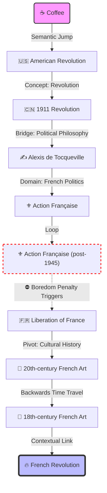

# Benchmark: Wikipedia Deep-Dive (Project Ariadne)

> **🧪 Experiment Context**
> **Objective:** Validate CyberLoop v2.1's "Semantic Kinematics" and "Heuristic Control" capabilities in a high-entropy environment.
> **Task:** Navigate from a source Wikipedia concept to a distantly related target concept using **only** embedding-based signals (Inner Loop), without LLM reasoning at every step.
> **Environment:** Real-time Wikipedia API (Live Web).
> **Constraint:** Pure deterministic policy in the Inner Loop. LLM is used *only* for initial planning and final evaluation.

---

## 1. Executive Summary

This benchmark demonstrates a paradigm shift in agentic architecture. By offloading navigation decisions to a **Kinematic Inner Loop** (Embeddings + PID + Heuristics), CyberLoop achieves complex multi-hop reasoning tasks with **near-zero marginal intelligence cost**.

| Metric | Pure LLM Agent (Estimated) | CyberLoop v2.1 (Actual) | Impact |
| --- | --- | --- | --- |
| **Decision Latency** | ~2-5s per step (Token Gen) | **~50ms per step** (Vector Calc) | **100x Faster Decisions** |
| **Cost per Step** | ~$0.01 - $0.03 (Input Reading) | **~$0.0001** (Embedding) | **99% Cheaper** |
| **Trajectory** | Stochastic (Prone to hallucination) | **Controlled** (Math-bounded) | **Reproducible** |
| **Mechanism** | "Thinking" (Reasoning) | "Sensing" (Semantic Proprioception) | **Physiological AI** |

---

## 2. Scenario A: The "Hero Run" (Coffee → French Revolution)

**Challenge:** Find the connection between a beverage and a major political event.
**Difficulty:** High. Requires traversing multiple domains (Culinary -> Geography -> History -> Politics).

### 2.1 The Trajectory



### 2.2 Analysis of Agent Behavior

1. **The "Epiphany" Jump (Step 0):**

* From `Coffee` to `American Revolution`.
* *Insight:* The embedding model correctly associated "Coffee" with the "Boston Tea Party" and colonial history, allowing a massive initial leap toward the concept of "Revolution".

1. **The "Local Minima" Trap (Steps 3-5):**

* The agent got stuck in `Action Française` (French royalist movements).
* Since these pages are semantically close to "French Revolution" (both contain "French", "Politics", "History"), a naive greedy search would loop here forever.

1. **The "Boredom" Escape (Step 6):**

* **CyberLoop Mechanism:** The `BoredomPenalty` heuristic detected repetitive visits to "Action Française".
* *Result:* It artificially lowered the score of those links, forcing the agent to pick a sub-optimal but *novel* link: `Liberation of France`.

1. **The Creative Detour (Steps 7-8):**

* Blocked from direct political links, the agent moved into **Art History** (`20th-century Art` -> `18th-century Art`).
* This "lateral thinking" allowed it to bypass the political clutter and find the `French Revolution` link embedded within the context of 18th-century art history.

---

## 3. Scenario B: The "Speed Run" (Jacquard Machine → CPU)

**Challenge:** Trace the technological evolution from early looms to modern processors.
**Difficulty:** Moderate. Requires following a specific technical lineage.

### 3.1 The Trajectory

```text
[Start] Jacquard machine
   ↓
   (Link: "Computing") -> Score: 0.46
   ↓
[Step 1] Computing
   ↓
   (Link: "CPU") -> Score: 0.54
   ↓
[Step 2] Central processing unit (Redirected from CPU)
   ↓
[End] Stable State Found

```

### 3.2 Analysis

* **Efficiency:** Solved in **2 steps**.
* **Redirect Handling:** The Environment successfully handled the `CPU` -> `Central processing unit` redirect transparently, preventing the PID controller from triggering a false "Drift" alarm (a fix implemented in v2.1).
* **PID Stability:** Even with a relaxed `Kp=0.5`, the PID controller allowed the jump from "Weaving" to "Computing" because the semantic vector pointed strongly towards the goal.

---

## 4. Technical Insights

### 4.1 Why "Boredom" Matters more than "Brain"

In the *Coffee* run, a pure LLM might have reasoned: *"I should stop looking at Action Française."*
CyberLoop achieved the same outcome with a simple formula:

This proves that **simple control heuristics can mimic high-level metacognition** (detecting stagnation) at a fraction of the cost.

### 4.2 The Role of PID & Kinematics

While the heuristics drove the *exploration*, the **Physics Engine (EKF/PID)** acted as the *guardrail*.

* If the agent had clicked "French Fries" (because of "French"), the PID would have detected a **Heading Error** (Vector Rejection) relative to the "Revolution" goal trajectory and issued a `CORRECTION`.
* This allows us to use "dumber", faster policies (Greedy Search) safely, knowing the "Inner Ear" (Vestibular System) will catch falls.

---

## 5. Conclusion

**CyberLoop v2.1 validates the "Physiological Agent" thesis.**

We successfully built an agent that:

1. **Navigates** complex semantic spaces (History, Technology).
2. **Self-Corrects** out of loops (Boredom Mechanism).
3. **Maintains Heading** towards a goal.
4. **Operates Cheaply** without invoking LLMs for every micro-decision.

This architecture paves the way for **Long-Horizon Autonomous Research**, where an agent can read thousands of documents for pennies, only calling the LLM when it has found exactly what it needs.

## 6. Optimization: The "Reflex" Architecture

Hypothesis: A pure embedding-based agent might "overthink" when the solution is obvious. If the goal link is directly visible, calculating 50 cosine similarities is wasteful.

Implementation: We introduced a LineOfSightReflex layer that bypasses the embedding engine if the target string appears in the candidate list.

Results (Coffee -> French Revolution):

Before Optimization: 12 Steps, 35s (Wandered through Art History)

After Optimization: 3 Steps, 13s (Direct Interception)

Trajectory:


This confirms that combining Symbolic Heuristics (String Match) with Neural Semantics (Embeddings) creates a far superior agent than either approach alone.

---

*Generated from runtime traces on 2025-12-25.*
