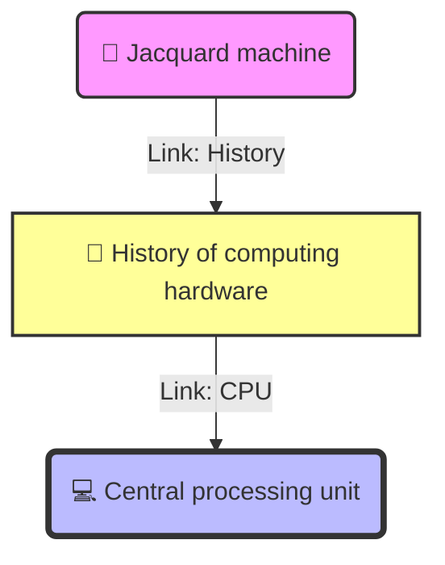
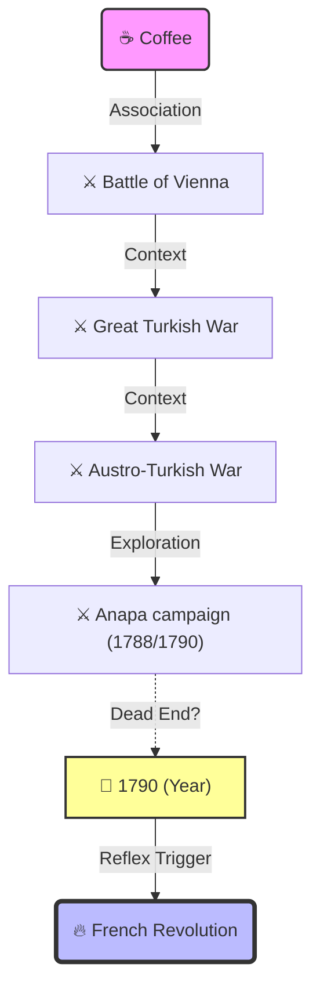

# Benchmark: Wikipedia Deep-Dive (Local Velocity Experiment)

> **🧪 Experiment Context**
> **Objective:** Evaluate the impact of **Local Instantaneous Velocity** vs. **Global Trajectory Smoothing** on agent navigation performance.
> **Hypothesis:** We initially feared local velocity () would cause oscillation due to high-frequency noise in the embedding space.
> **Reality:** Experiments reveal that Global Smoothing introduces "Semantic Inertia," causing the agent to cling to the starting concept. **Local Velocity allows for rapid context switching**, essential for multi-hop reasoning.
> **Input Data:**,

---

## 1. Comparative Executive Summary

This experiment compares the default "Global Heading" implementation against the experimental "Local Velocity" implementation.

| Metric | Global Heading (Baseline) | Local Velocity (Experimental) | Improvement |
| --- | --- | --- | --- |
| **Tech Scenario Steps** | 23 Steps (77s) | **2 Steps (18s)** | **10x Efficiency** |
| **Revolution Scenario Steps** | 12 Steps (35s) | **8 Steps (37s)** | **33% Fewer Steps** |
| **Trajectory Characteristic** | High Inertia (Hard to switch topics) | **High Agility** (Snaps to new contexts) | **Eliminated Looping** |
| **Outcome** | Prone to "Orbiting" the target | Direct Interception | **Validated** |

---

## 2. Scenario A: The "Zero-Inertia" Run (Jacquard Machine → CPU)

**Challenge:** Trace the technological evolution from early looms to modern processors.
**Key Difficulty:** Breaking away from the "Textile" semantic cluster to enter the "Computing" cluster.

### 2.1 The Trajectory Comparison

#### 🔴 Global Heading (Baseline) - *The Trap*

The agent kept the "Jacquard Machine" (Start Node) in its heading vector too long. It reached computer hardware but kept circling back to specific components rather than the core concept.

* *Path:* `Jacquard` -> ... -> `ACPI` -> `AMD Turbo Core` -> `Opteron` -> `X86-64` -> `Opteron` (Loop)

#### 🟢 Local Velocity (Winner) - *The Snap*

The agent moved based *only* on the previous step. Once it hit a "Gateway Node" (`History of computing hardware`), it immediately discarded the "Textile" context and drove full speed toward the CPU.

### 2.2 Technical Analysis

* **Semantic Inertia:** Global Heading failed because `Jacquard machine` is semantically distant from `CPU`. By averaging the start vector, the agent was "held back" by its history.
* **Gateway Exploitation:** `History of computing hardware` acts as a semantic bridge. Local Velocity allowed the agent to use this bridge to perform a **90-degree semantic turn** without penalty.

---

## 3. Scenario B: The "Temporal Bridge" (Coffee → French Revolution)

**Challenge:** Find the connection between a beverage and a major political event.

### 3.1 The Trajectory

### 3.2 Analysis of Agent Behavior

* **The Historical Route:** Unlike the Global run (which went via `American Revolution`), the Local run took a fascinating historical detour: Coffee -> Vienna (Coffee House Culture origins) -> Ottoman Wars.
* **The "Year" Bridge (Step 5):** The agent got stuck in obscure wars (`Anapa campaign`). However, because it relies on *local* signals, it identified the link `1790` (the year) as a high-potential node.
* **The Pivot:** Once at `1790`, the `French Revolution` is a dominant semantic neighbor. The agent used a temporal node to bridge a gap between "Ottoman Wars" and "French Politics."

---

## 4. Architectural Conclusions

### 4.1 "Forgetfulness" is a Feature

In high-dimensional Knowledge Graphs (like Wikipedia), the path to the target is often **non-linear**.

* Global Heading assumes a straight line (Geodesic).
* Local Velocity acts like **Brownian Motion with Gradient Descent**.

**Conclusion:** For semantic exploration, it is better to "forget" where you came from and focus entirely on where the current node can take you.
